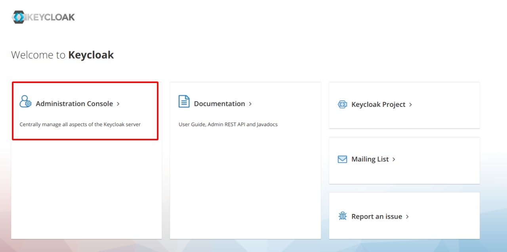
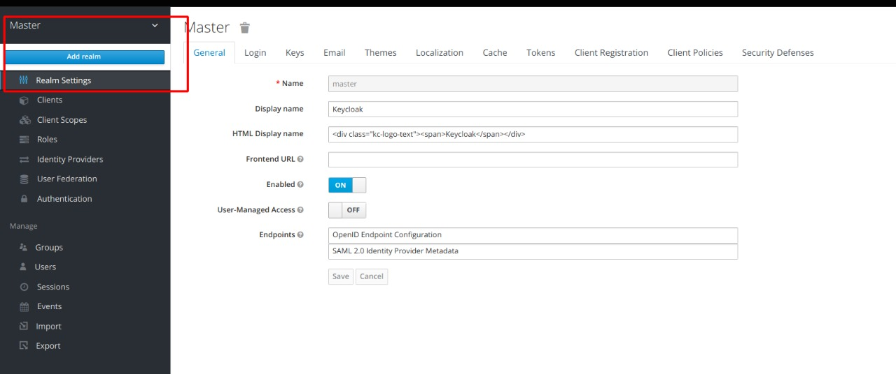
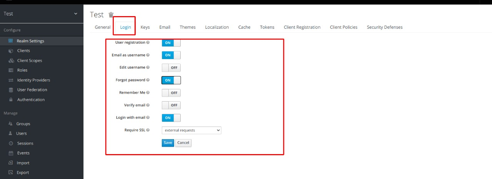
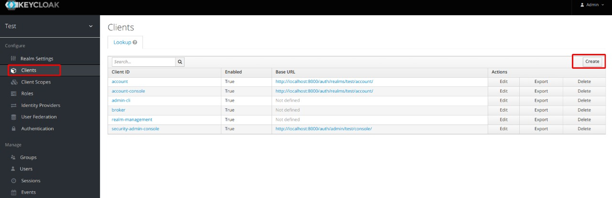
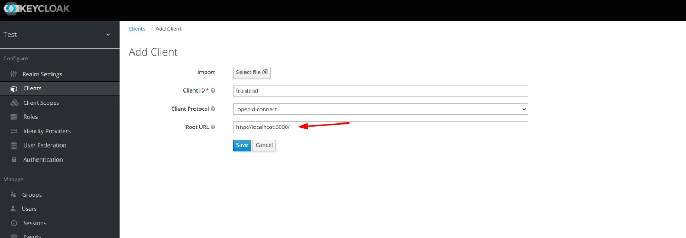
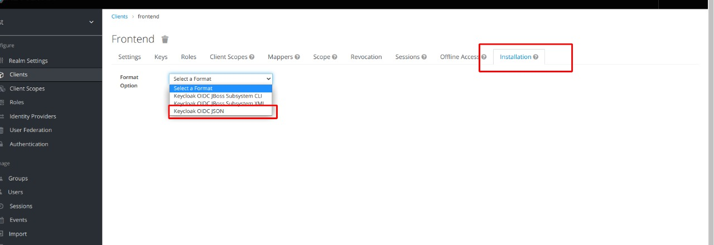
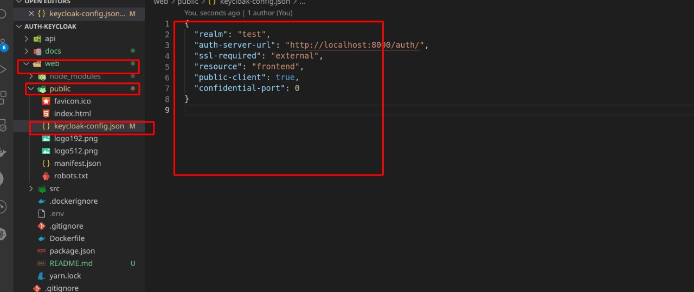

# Exemplos de Integração do ReactJS, Keycloack e Nodejs :red_heart

Esse repositório tem um exemplo de como integrar o ReactJS, NodeJS e Keycloak.

Para executar esse projeto, você precisa ter instalado as seguintes dependências:

- [docker](https://docs.docker.com/engine/install/);
- [docker-compose](https://docs.docker.com/compose/install/);
- [make](https://linuxconfig.org/command-make-not-found-on-ubuntu-20-04-focal-fossa) (Opicional).

### Executando projeto

1. Faça clone do projeto: `git clone git@github.com:warteruzannan/keycloak-nodejs-react-exemplo.git`
2. Entre no diretório `cd keycloak-nodejs-react-exemplo`
3. Execute o comando usando Make: `make app-build-up`.

### Configurando o Helm no Keycloack:

1. Acesse o console Keycloak url `http://localhost:8000`. Entre em console e insira a senha do admin:

`username: admin`

`password: admin`

2. Vá em helms e crie um helm com o nome escolhido. **Observação**: Altere o variável `ENV KEYCLOAK_HELM=test` no Dockerfile da api.

3. Configure as opções de login para usuários.

4. No helm criado anteriormente, crie um cliente para acessar o Keycloak.

5. Escolha o nome do cliente e insira a url autorizada. Nesse exemplo, use a url `http://localhost:3000`

6. Escolha o cliente e vá em Instalações. Na opção Format, escolha `Keycloak OIDC Json` e copie o conteúdo apresentado.

6. Substitua o conteúdo em `web/public/keycloak-config.json`

7. **Importante para esse exemplo. Essa etapa é necessária apenas na primeira execução**: Interrompa a execução do docker-compose e execute o comando usando Make: `make app-build-up`.

8. Finalmente, acesse a url da aplicação ReactJS `http://localhost:3000`e crie o seu usuário. Se tudo funcionar corretamente, os seus amigos irão ser carregados da api.

